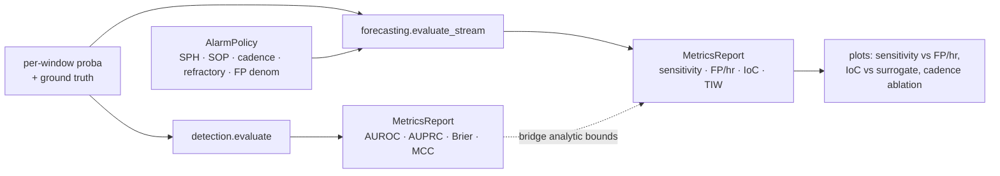

# SciTeX Seizure Metrics (`scitex-seizure-metrics`)

<p align="center">
  <a href="https://scitex.ai">
    
  </a>
</p>

<p align="center"><b>Unified evaluation library for seizure detection and forecasting — sample-based, alarm-based, and the bridge between them.</b></p>

<p align="center">
  <a href="https://scitex-seizure-metrics.readthedocs.io/">Full Documentation</a> · <code>pip install scitex-seizure-metrics</code>
</p>

<!-- scitex-badges:start -->
<p align="center">
  <a href="https://pypi.org/project/scitex-seizure-metrics/"></a>
  <a href="https://pypi.org/project/scitex-seizure-metrics/"></a>
  <a href="https://github.com/ywatanabe1989/scitex-seizure-metrics/actions/workflows/test.yml"></a>
  <a href="https://codecov.io/gh/ywatanabe1989/scitex-seizure-metrics"></a>
  <a href="https://scitex-seizure-metrics.readthedocs.io/en/latest/"></a>
  <a href="https://www.gnu.org/licenses/agpl-3.0"></a>
</p>
<!-- scitex-badges:end -->

---

## Problem and Solution

| # | Problem | Solution |
|---|---------|----------|
| 1 | **Cross-paper comparison is broken** — Cook 2013 reports time-in-warning, Karoly 2017 reports AUROC + Brier, Maturana 2020 reports AUROC + IoC, Kuhlmann 2018 reports AUROC, Proix 2021 reports IoC + AUC of sensitivity vs proportion-time-in-warning. No two of these can be plotted on the same axis without re-running their methods. | **One `MetricsReport` object** carries both regimes through one API; `bridge.sample_to_alarm` gives analytic bounds when only one side is reported. |
| 2 | **Sample- vs alarm-based collapse is documented but untooled** — Andrade 2024 showed that 50/56 patients beat chance under sample-based eval but **only 6/46 under alarm-based**. The community accepts the warning but has no packaged tool to apply both regimes routinely. | **`detection.evaluate` + `forecasting.evaluate_stream`** through one library; same input, both regimes side-by-side. |
| 3 | **FP/hr lacks a denominator convention** — some papers normalise by total recording time, some by interictal-only time, refractory rules vary or are unstated. | **Explicit `AlarmPolicy`** required by every alarm-aware function — no silent defaults; every reported number is reproducible. |

<details>
<summary><b>Comparison with existing tools</b></summary>

| Tool | Language | Sample-based | Event-based | Forecasting (SPH/SOP) | IoC vs surrogate | Cross-paper convertor | Status |
|---|---|---|---|---|---|---|---|
| `timescoring` (SzCORE engine, [Dan et al. 2024](https://doi.org/10.1111/epi.18113)) | Python | ✅ | ✅ | ❌ | ❌ | ❌ | maintained |
| `szcore-evaluation` (BIDS wrapper) | Python | ✅ | ✅ | ❌ | ❌ | ❌ | maintained |
| `EPILAB` ([Direito et al. 2011](https://doi.org/10.1016/j.jneumeth.2011.06.022)) | MATLAB | ✅ | ◐ | ✅ | ✅ | ❌ | last release 2018 |
| `PySeizure` ([2025](https://arxiv.org/html/2508.07253)) | Python | ✅ | ❌ | ❌ | ❌ | ❌ | early — focused on detection |
| `SeizyML` ([2024](https://pmc.ncbi.nlm.nih.gov/articles/PMC11160878/)) | Python | ✅ | ✅ | ❌ | ❌ | ❌ | detection scope |
| Andrade et al. 2024 (paper) | — | ✅ | ✅ | ✅ | ✅ | ❌ | research code, not a package |
| **scitex-seizure-metrics** | Python | ✅ | ✅ | ✅ | ✅ | ✅ | this repo |

</details>

## Supported Metrics

Quick definitions for the metrics and policy knobs that recur throughout
the README, the docstrings, and the cited papers.

<details>
<summary><b>Sample-based metrics</b></summary>

| Term | Meaning |
| --- | --- |
| **AUROC** | Area Under the Receiver Operating Characteristic curve. Probability the model ranks a random positive window above a random negative window. Threshold-free; insensitive to class prevalence. |
| **AUPRC** | Area Under the Precision–Recall curve. Threshold-free; **sensitive to class prevalence** — the value to read on heavily-imbalanced seizure data when AUROC looks deceptively high. |
| **Brier** | Mean squared error between predicted probability and the 0/1 label. Lower is better. Decomposes into reliability + resolution + uncertainty (`scitex_seizure_metrics.calibration`). |
| **MCC** | Matthews Correlation Coefficient. A single balanced summary statistic robust to class imbalance; ranges from −1 (anti-correlation) through 0 (chance) to +1 (perfect). |
| **Balanced accuracy** | (Sensitivity + Specificity) / 2. The accuracy you would get if the prevalence were 50/50. |
| **Sensitivity** (recall) | Fraction of true seizures detected. Reported at a chosen threshold. |
| **Precision** (PPV) | Fraction of detections that were true seizures. Drops fast under low prevalence. |
| **ECE** | Expected Calibration Error. Average gap between predicted probability and observed frequency across bins. |

</details>

<details>
<summary><b>Alarm-based metrics</b></summary>

| Term | Meaning |
| --- | --- |
| **Alarm** | A single binary "warning is on" event derived from a thresholded probability stream + the `AlarmPolicy`. |
| **FP/hr** (false-positive rate per hour) | Number of alarms not followed by a seizure within (SPH, SPH + SOP], normalised by the chosen denominator (`fp_denominator='total'` or `'interictal'`). |
| **IoC** | Improvement over Chance. The signed gap between the model's alarm-based sensitivity and the same statistic recomputed under a chance-baseline alarm generator (`scitex_seizure_metrics.surrogates`, default Poisson). Significance is read from a surrogate distribution. |
| **Time-in-warning** (TIW, "proportion time in warning") | Fraction of recording time spent inside an active warning window (between alarm onset and refractory end). The natural denominator that pairs with sensitivity in the Proix 2021 operating curve. |
| **Sensitivity vs proportion-time-in-warning** | Operating curve introduced by Proix 2021. Plotted instead of sensitivity vs FP/hr when alarm refractory periods make per-hour counts misleading. Same x-axis units as Cook 2013's "time-in-warning" reporting. |
| **Beats chance (alarm)** | Boolean — is the model's IoC above the surrogate distribution at the configured significance level? Andrade 2024's headline: 50/56 patients beat chance under sample-based eval but only 6/46 under alarm-based. |

</details>

> The `AlarmPolicy` config knobs (SPH · SOP · cadence · refractory ·
> alarm-threshold · FP-denominator) are documented inline on the
> dataclass and shown in the forecasting example below — they pin
> alarm-derivation, not metric definitions.

## Installation

```bash
pip install scitex-seizure-metrics
```

## Quick Start

```python
from scitex_seizure_metrics import detection, forecasting, AlarmPolicy

# Detection — per-window classification
rep = detection.evaluate(y_true, y_proba, threshold=0.5, fs=1)
print(rep.roc_auc, rep.pr_auc, rep.brier, rep.mcc)

# Forecasting — continuous stream with explicit alarm policy
policy = AlarmPolicy(
    sph_seconds=300, sop_seconds=600, cadence_seconds=60,
    refractory_seconds=600, alarm_threshold=0.5,
    fp_denominator="interictal",   # Mormann tradition
)
rep = forecasting.evaluate_stream(
    proba, times, seizures, policy,
    total_recording_time=24 * 3600,
)
print(rep.sensitivity, rep.fp_per_hour, rep.ioc, rep.time_in_warning_frac)
```

See `examples/quick_start_detection.py` and `examples/quick_start_forecasting.py`.

## Architecture



The split mirrors how the seizure-evaluation literature itself is
organised — sample-based vs alarm-based vs the bridge — so a
paper-faithful re-implementation lives in exactly one place.
`MetricsReport` is the single object that travels between regimes;
`AlarmPolicy` is the single object that pins every reproducibility
decision an alarm-based metric requires.

## 6 Interfaces

<details open>
<summary><b><code>scitex_seizure_metrics.forecasting</code></b> — alarm-based metrics with explicit AlarmPolicy (primary)</summary>

```python
from scitex_seizure_metrics import AlarmPolicy, forecasting

policy = AlarmPolicy(
    sph_seconds=300, sop_seconds=600, cadence_seconds=60,
    refractory_seconds=600, alarm_threshold=0.5,
    fp_denominator="interictal",
)
rep = forecasting.evaluate_stream(
    proba, times, seizures, policy,
    total_recording_time=24 * 3600, n_surrogate=1000,
)
print(rep.sensitivity, rep.fp_per_hour, rep.ioc, rep.time_in_warning_frac)

# Operating curve across thresholds
df = forecasting.sweep_thresholds(proba, times, seizures, policy)

# Cadence ablation
policies = [AlarmPolicy(..., cadence_seconds=c) for c in [30, 60, 120, 300]]
df = forecasting.sweep_policies(proba, times, seizures, policies)
```

</details>

<details>
<summary><b><code>scitex_seizure_metrics.detection</code></b> — sample-based metrics (AUROC, AUPRC, Brier, MCC, ...)</summary>

```python
from scitex_seizure_metrics import detection
rep = detection.evaluate(y_true, y_proba, threshold=0.5, fs=1)
print(rep.roc_auc, rep.pr_auc, rep.brier, rep.mcc, rep.balanced_accuracy)
```

</details>

<details>
<summary><b><code>scitex_seizure_metrics.bridge</code></b> — sample↔alarm analytic bounds for cross-paper comparison</summary>

```python
from scitex_seizure_metrics import bridge

bnd = bridge.sample_to_alarm(
    sample_sensitivity=0.79, sample_specificity=0.85,
    sop_seconds=600, cadence_seconds=60, refractory_seconds=600,
)
print(bnd.alarm_sensitivity_upper, bnd.fp_per_hour_upper)
```

</details>

<details>
<summary><b><code>scitex_seizure_metrics.papers</code></b> — paper-replica shims (Karoly 2017, Maturana 2020, Kuhlmann 2018, Andrade 2024)</summary>

```python
from scitex_seizure_metrics.papers import andrade2024
out = andrade2024.metrics(
    y_true=labels, y_proba=preds,
    times_seconds=times, seizure_times=onsets,
)
print(out["sample_auroc"], out["alarm_sensitivity"], out["beats_chance_alarm"])
# Reproduces the side-by-side sample-vs-alarm panel from the paper.
```

Available shims: `karoly2017`, `maturana2020`, `kuhlmann2018`, `andrade2024`. Each `metrics(...)` returns a dict in the paper's preferred metric set.

</details>

<details>
<summary><b><code>scitex_seizure_metrics.calibration</code></b> — Brier decomposition + reliability diagram</summary>

```python
from scitex_seizure_metrics import calibration, plots
cal = calibration.calibration_report(y_true, y_proba, n_bins=10)
print(cal.brier, cal.reliability, cal.resolution, cal.uncertainty,
      cal.expected_calibration_error)
plots.reliability_diagram(cal)
```

</details>

<details>
<summary><b><code>scitex_seizure_metrics.plots</code></b> — relationships between metrics</summary>

```python
from scitex_seizure_metrics import plots
plots.sensitivity_vs_fp_per_hour(sweep_df)        # operating curve
plots.ioc_vs_surrogate(sweep_df)                  # model vs chance
plots.cadence_ablation(policy_sweep_df)           # FP/hr vs cadence
plots.sample_vs_alarm_scatter(per_patient_df)     # the Andrade 2024 figure
plots.metric_correlation_heatmap(per_patient_df)  # redundancy diagnostic
```

</details>

## References

- Andrade I, Teixeira C, Pinto M (2024). On the performance of seizure prediction machine learning methods across different databases: the sample and alarm-based perspectives. *Frontiers in Neuroscience*. [doi:10.3389/fnins.2024.1417748](https://doi.org/10.3389/fnins.2024.1417748).
- Cook MJ et al. (2013). *Lancet Neurology*. [doi:10.1016/S1474-4422(13)70075-9](https://doi.org/10.1016/S1474-4422(13)70075-9).
- Dan J et al. (2024). SzCORE. *Epilepsia*. [doi:10.1111/epi.18113](https://doi.org/10.1111/epi.18113).
- Direito B et al. (2011). EPILAB. *J Neurosci Methods*. [doi:10.1016/j.jneumeth.2011.06.022](https://doi.org/10.1016/j.jneumeth.2011.06.022).
- Karoly PJ et al. (2017). *Brain*. [doi:10.1093/brain/awx173](https://doi.org/10.1093/brain/awx173).
- Kuhlmann L et al. (2018). *Brain*. [doi:10.1093/brain/awy210](https://doi.org/10.1093/brain/awy210).
- Maturana MI et al. (2020). *Nature Communications*. [doi:10.1038/s41467-020-15908-3](https://doi.org/10.1038/s41467-020-15908-3).
- Mormann F et al. (2007). Seizure prediction: the long and winding road. *Brain*. [doi:10.1093/brain/awl241](https://doi.org/10.1093/brain/awl241).
- Schulze-Bonhage A et al. (2020). Performance Metrics for Online Seizure Prediction. [PMC7340210](https://pmc.ncbi.nlm.nih.gov/articles/PMC7340210/).

## Part of SciTeX

`scitex-seizure-metrics` is part of [**SciTeX**](https://scitex.ai). Install via the umbrella with `pip install scitex-ml[seizure]` to use as `scitex_ml.metrics.seizure` (the seizure-evaluation namespace inside `scitex-ml`).

>Four Freedoms for Research
>
>0. The freedom to **run** your research anywhere — your machine, your terms.
>1. The freedom to **study** how every step works — from raw data to final manuscript.
>2. The freedom to **redistribute** your workflows, not just your papers.
>3. The freedom to **modify** any module and share improvements with the community.
>
>AGPL-3.0 — because we believe research infrastructure deserves the same freedoms as the software it runs on.

---

<p align="center">
  <a href="https://scitex.ai" target="_blank"></a>
</p>
